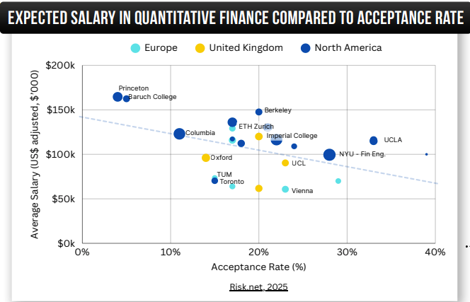

# Quantitative Finance Jobs Research

A comprehensive data analysis project investigating quantitative finance job markets, including salary distributions, required skills, and programming languages across different roles and geographical regions.

All insights are drawn from available jobs data in Jun 2025 and Risk.net's 2025 review on quant finance programs.

## 🎯 Project Overview

This project analyzes the quantitative finance job market by extracting and processing job postings from Google Jobs using SerpAPI. The analysis provides insights into:

- **Salary distributions** across different quant roles
- **Required skills** and qualifications for each position type
- **Programming languages** and libraries in demand
- **Geographical variations** in job availability and compensation

**Inspiration**: This project was inspired by [Luke Barousse's](https://www.lukebarousse.com/) excellent data analyst job processing pipeline. I wanted to explore similar methodologies applied specifically to the quantitative finance domain.

## 📊 Key Findings

All findings are summarised in **The Quant Protocol** eBook and complements research on top quant finance university program by Risk.net, 2025 [review](https://www.risk.net/quantitative-finance/7960103/quant-finance-masters-guide-2025). The Quant Protocol can be found [here](https://www.quantpykit.com/).

### Salary Analysis (USD, Annualized)

Based on analysis of US only job postings, here is the median salary information:

| Role                           | Median Salary | Job Count |
| ------------------------------ | ------------- | --------- |
| Quantitative Portfolio Manager | $175,000      | 354       |
| Quantitative Researcher        | $171,600      | 357       |
| Quantitative Strategist        | $165,000      | 47        |
| Quantitative Developer         | $149,250      | 284       |
| Financial Engineer             | $143,100      | 122       |
| Model Validation Analyst       | $130,492      | 250       |
| Quantitative Trader            | $109,200      | 419       |
| Quantitative Risk Analyst      | $102,000      | 151       |


_Distribution of quantitative finance salaries across all roles in the US market_


_Detailed salary distribution breakdown by specific quantitative finance roles_

### Most In-Demand Skills

Trading stands out as the most frequent and in-demand skill across quantitative finance roles. However, this dominance makes sense — virtually all financial market activities ultimately revolve around trading. Functions such as valuation, risk management, and quantitative research are all designed to support, enhance, or execute trading decisions.

It’s also important to note that while trading itself is not something typically taught in a quantitative finance master’s program, every other skill on this list is. Trading is proprietary — you learn it by doing it. To master it, you need to be where professional traders are, observe how they operate, and ideally, get paid to learn on the job.

1. **Trading** — Market Execution and Strategy
2. **Research** — Strategy Development and Model Validation
3. **Analysis** — Data-Driven Insights
4. **Risk Management** — Measuring and Controlling Exposure
5. **Programming** — Building the Quantitative Infrastructure
6. **Mathematics** — The Foundation of Financial Theory
7. **Statistics** — Data Modeling and Inference
8. **Pricing** — Valuation of Financial Instruments
9. **Machine Learning** — Predictive Modeling and Automation
10. **Optimization** — Efficient Portfolio and Strategy Design


_Frequency analysis of the top 50 skills mentioned in quantitative finance job descriptions_

### Top Programming Languages & Libraries

- **Languages**: Python, SQL, R
- **Libraries**: pandas, numpy, TensorFlow


_Most frequently requested programming languages in quantitative finance job postings_


_Most popular libraries and frameworks in quantitative finance roles_

## 🔧 Technical Implementation

### Data Collection Pipeline

The project uses a two-stage data collection approach:

1. **US Job Market**: Focused searches across major financial hubs (NYC, California, Texas, Illinois, Florida)
2. **International Markets**: Weighted sampling based on YouTube channel viewership data from 27 countries

### Search Terms Analyzed

- Quantitative Researcher
- Quantitative Analyst
- Quantitative Trader
- Algorithmic Trader
- Quantitative Developer
- Quantitative Software Engineer
- Model Validation Analyst
- Quantitative Risk Analyst
- Quantitative Portfolio Manager
- Financial Engineer
- Quantitative Strategist
- And more specialized roles...

## 📁 Project Structure

```
quant-jobs-research/
├── quant-job-extraction.ipynb     # Data extraction from SerpAPI
├── quant-job-cleaning.ipynb       # Data cleaning and analysis
├── requirements.txt               # Python dependencies
├── data/
│   ├── us jobs/                  # US job data by role
│   ├── country/                  # International job data by country
│   ├── insights/                 # Processed analysis results
│   ├── word lists/               # Curated skill and technology lists
│   └── youtube/                  # YouTube viewership data for sampling
└── README.md
```

## 🚀 Getting Started

### Prerequisites

- Python 3.8+
- Jupyter Lab/Notebook
- SerpAPI key (register at [serpapi.com](https://serpapi.com/))

### Installation

1. Clone the repository:

```bash
git clone https://github.com/TheQuantPy/quant-jobs-research.git
cd quant-jobs-research
```

2. Install dependencies:

```bash
pip install -r requirements.txt
```

3. Set up environment variables:

```bash
# Create .env file with your SerpAPI key
echo "SERPAPI_KEY=your_serpapi_key_here" > .env
```

### Usage

1. **Data Extraction**: Run `quant-job-extraction.ipynb` to collect fresh job data
2. **Data Analysis**: Execute `quant-job-cleaning.ipynb` to process and analyze the data

## 📈 Analysis Methodology

### Data Cleaning & Normalization

- **Currency Conversion**: All salaries normalized to USD using current exchange rates
- **Rate Standardization**: Hourly, daily, and monthly rates converted to annual equivalents
- **Role Categorization**: Job titles mapped to standardized quantitative finance role categories

### Salary Analysis

- Statistical analysis using percentiles (5th, 25th, 50th, 75th, 95th)
- Box and whisker plots for distribution visualization
- Role-based salary ranking and comparison

### Skills Extraction

- Frequency analysis of job description text
- Curated word lists for quantitative finance skills
- Separate analysis for:
  - Core quantitative skills
  - Programming languages
  - Software libraries and tools

### Geographic Sampling

International job searches weighted by YouTube channel audience distribution to represent global interest in quantitative finance careers.

## 📊 Key Insights & Visualizations

The analysis generates several key outputs:

- **Salary distribution charts** by role
- **Skills frequency analysis** across all job descriptions
- **Programming language popularity** rankings
- **Library and tool usage** statistics

All visualizations and processed data are saved in the `data/insights/` directory.

### Additional Analysis: Salary Expectations vs. Reality

The Quant Protocol complements these insights with the Risk.net's 2025 review of top Quant Finance programs. My insight from this work can be summarised below:



_Analysis of salary expectations versus actual acceptance rates in quantitative finance roles_


_Expected salary progression for post-graduate positions in quantitative finance_

## ⚠️ Limitations & Future Improvements

### Current Limitations

1. **Duplicate Entries**: Job postings may appear multiple times across different recruitment agencies
2. **Role Classification**: Relies on search terms rather than ML-based role categorization
3. **Sample Bias**: Limited to Google Jobs listings via SerpAPI
4. **Temporal Scope**: Analysis based on monthly job posting snapshots

### Proposed Enhancements

1. **Deduplication Algorithm**: Implement fuzzy matching to remove duplicate job listings
2. **ML-based Role Classification**: Train models to categorize jobs based on descriptions rather than titles
3. **Temporal Analysis**: Track salary and skill trends over time
4. **Company Analysis**: Analyze differences between investment banks, hedge funds, and tech companies

## 🤝 Contributing

Contributions are welcome! Areas for contribution include:

- Enhanced data cleaning algorithms
- Additional visualization techniques
- Extended international market coverage
- Machine learning model improvements

## 📄 License

This project is licensed under the MIT License - see the [LICENSE](LICENSE) file for details.

## 🙏 Acknowledgments

- **Luke Barousse** for the original data analyst job pipeline inspiration and methodology
- **SerpAPI** for providing reliable job search data access
- **The Quantitative Finance Community** for domain expertise and validation

## 📞 Contact

For questions, suggestions, or collaboration opportunities, please reach out through the repository issues or visit [TheQuantPy](https://github.com/TheQuantPy).

---

_This analysis represents a snapshot of the quantitative finance job market and should be used for informational purposes. Market conditions and salary ranges may vary significantly based on experience, location, and market timing._
